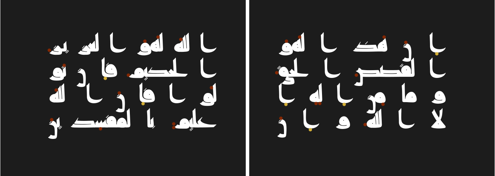

Raqq
====

_Raqq_ (رَقّ) is a manuscript Kufic typeface, that intends to replicate (as
faithfully as possible) the third century AH (early Abbasid) style of Kufic
script used in writing the Quran.

_Raqq_ uses color font technology to replicate the colored vocalization system
of red, yellow and green dots used in these early Quranic manuscripts.

_Raqq_ comes in two styles, a **text** and **display** style. The text style is
intended more for use in smaller font sizes (possibly inline in scholarly
texts) and has larger letter forms and more sturdy feel, while the display
style is intended for larger sizes and more artistic work and has more delicate
and refined feel.

The text style is based mostly on [MS Add.1116][1], while the display style is
based on [ARABE 350][2].

The text style is more complete, while the display style is still in early
stages.

_Raqq_ is Arabic for Parchment.

[1]: https://cudl.lib.cam.ac.uk/view/MS-ADD-01116
[2]: https://gallica.bnf.fr/ark:/12148/btv1b8415221r
