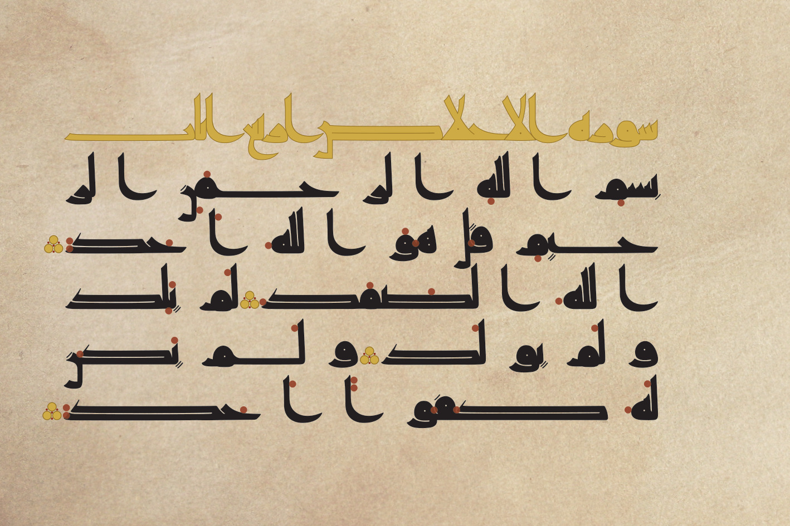
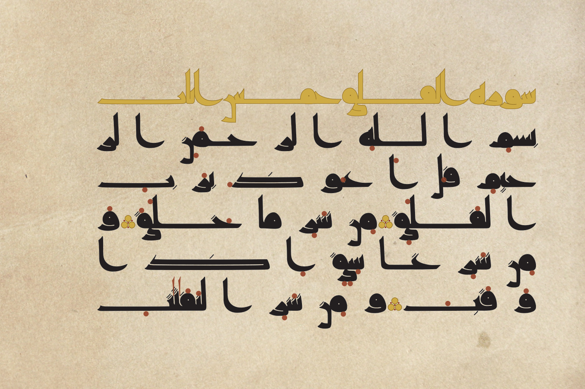
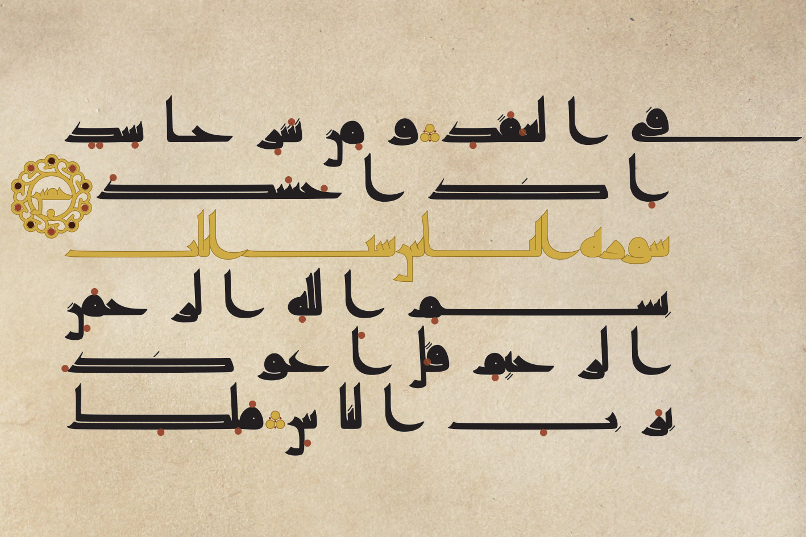
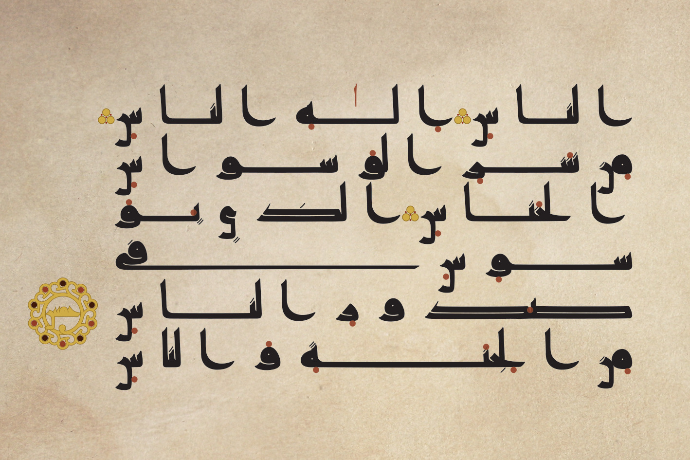
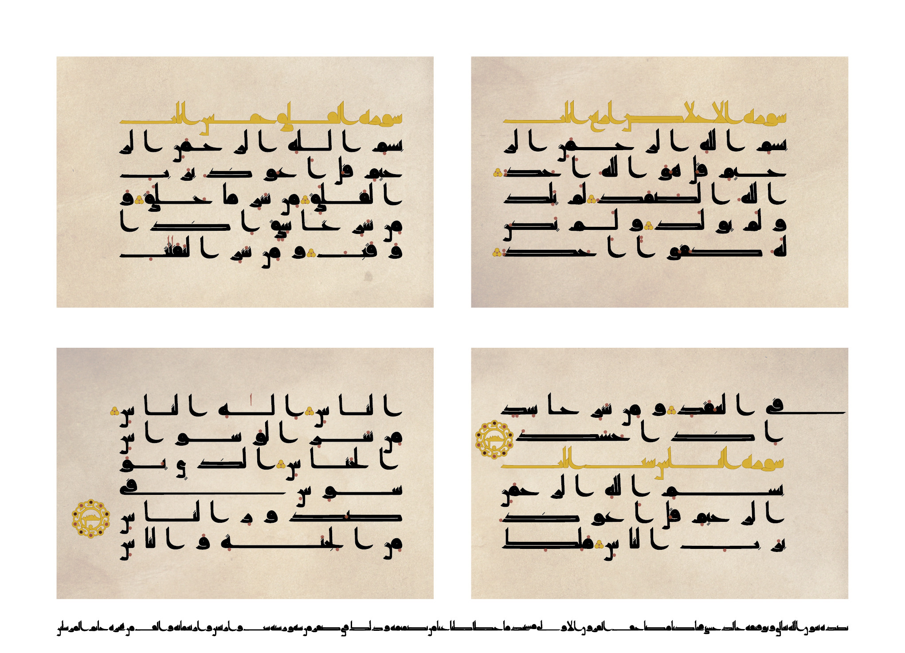

هذه بعض الأعمال الفنية المنفذة بخط [«رَقّ»](../).

## سورة الإخلاص والمعوذتين
نسقت هذه الصفحات على نسق المصاحف الكوفية:
- أسماء السور مكتوبة باللون الذهبي والكتابة محددة بلون أغمق، وخالية من نقاط الإعجام والإعراب، مع تضييق الفراغات بين الحروف لحد التداخل أحيانا
- متن السورة يبدأ بالبسملة ثم آيات السورة دون فاصل بين البسملة والآيات
- مسافة واسعة بين المقاطع مثلها مثل المسافة بين الكلمات
- قطع السطور بناء على المقاطع لا الكلمات
- نقاط إعراب مدورة باللون الأحمر، ونقاط إعجام مستطيلة بنفس مداد الكتابة
- نقاط ذهبية مزخرفة لعلامة الآية، مع استخدام دائرة محلاة كبيرة داخلها كلمة «خمس» عند كل خمس آيات مكتوبة بنفس أسلوب اسم السورة
- الإكثار من المشق لضبط طول السطر

